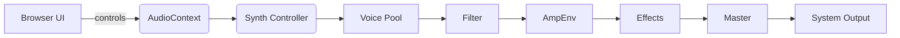
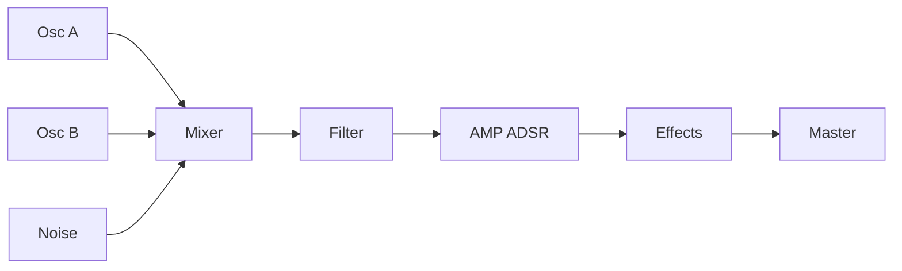

# Web Synth — Subtractive Analog (HTML5 + Web Audio API)

A compact, browser-based subtractive synthesizer demo using the Web Audio API. It ships as a small Node.js static server so you can run it locally and experiment with synth parameters and routing.

## Features

- Two oscillators (A/B): wave shape, detune, level
- Oscillator mix, noise generator
- Filter (Low/High/Bandpass) with Cutoff, Q, and envelope modulation
- Amp ADSR and Filter ADSR (per-voice)
- LFO (rate/depth) with multiple targets (pitch, detune, level, filter, mix)
- Polyphony with voice-stealing and per-voice routing
- Basic effects: Phase, Delay, Chorus
- Visuals: retro UI, VU meter, on-screen keyboard

## Quick start

1. Install dependencies:

   npm install

2. Start server:

   npm start

3. Open <http://localhost:3000> in a Chromium-based browser for best compatibility.

## Architecture (high-level)

## Signal flow (per voice)

## Tools used

- Node.js + Express for a tiny static server
- Web Audio API for audio synthesis
- nodemon (dev) for development

## Known issues

- **Phase effect** — partially implemented. Parameters (allpass staging, width/pan mapping, and wet routing) need refinement; audio artifacts present at extreme settings.
- **Delay effect** — partial feedback loop implemented. Needs better time/rate clamping and a feedback limiter to prevent runaway amplification.
- **Chorus effect** — basic multi-voice chorus exists. Voices and modulation depth need tuning to avoid phasing artifacts and CPU spikes.

See `ISSUES.md` for detailed issue entries and reproduction steps (also file GitHub Issues to track progress).

## Contributing

Feel free to open issues or PRs. If you add features (MIDI, presets, extra effects), keep the code readable and add short notes to the README.

## License

MIT — see the LICENSE file.

Enjoy!
