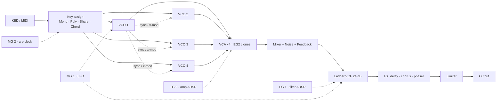

# Web Synth v2 <!-- instrument name TBD — rebrand pending -->

[](https://github.com/louissilvestri/web-synth/actions/workflows/ci.yml)
[](https://nextjs.org/)
[](https://www.typescriptlang.org/)
[](https://developer.mozilla.org/en-US/docs/Web/API/Web_Audio_API)
[](LICENSE)

A hybrid **paraphonic synthesizer in the browser**: the voice of a **Minimoog
Model D** (4 VCOs with the full waveform/range set, 24 dB transistor-ladder
filter, dual contours) driven by the performance brain of a **Korg Mono/Poly**
(key-assign modes, arpeggiator, chord memory, sync + cross-modulation).

> **Status: v2 ground-up rewrite in progress on the [`v2` branch](https://github.com/louissilvestri/web-synth/tree/v2)** —
> currently at **M0 (scaffold)**. The plan lives in [docs/PLAN.md](docs/PLAN.md);
> progress is tracked via [milestones](https://github.com/louissilvestri/web-synth/milestones)
> and the project board. The old v1 demo is preserved at the
> [`v1.0` tag](https://github.com/louissilvestri/web-synth/tree/v1.0).

## Architecture

The audio engine is a **typed module graph that mirrors the classic
subtractive block diagram** — authentic Mono/Poly paraphonic topology: four
individually pitched VCOs through **one shared ladder filter**, per-VCO amp
VCAs.


```mermaid
flowchart LR
  KBD[KBD / MIDI] --> KA[Key assign<br/>Mono · Poly · Share · Chord]
  KA --> V1[VCO 1] & V2[VCO 2] & V3[VCO 3] & V4[VCO 4]
  V1 -.sync / x-mod.-> V2 & V3 & V4
  V1 & V2 & V3 & V4 --> VCA[VCA ×4 · EG2 clones]
  VCA --> MIX[Mixer + Noise + Feedback]
  MIX --> VCF[Ladder VCF 24 dB]
  VCF --> FX[FX: delay · chorus · phaser]
  FX --> LIM[Limiter] --> OUT[Output]
  EG1[EG 1 · filter ADSR] -.-> VCF
  EG2[EG 2 · amp ADSR] -.-> VCA
  MG1[MG 1 · LFO] -.-> V1 & VCF
  MG2[MG 2 · arp clock] -.-> KA
```

- **DSP in an AudioWorklet** — polyBLEP band-limited oscillators, a
  Huovilainen/ZDF-style ladder model, exponential envelopes, hard sync and
  X-Mod at sample level. No Tone.js; native nodes can't express any of this.
- **Framework-free engine core** (`engine/`) — pure TypeScript, unit-tested
  without an AudioContext. React (Next.js App Router) renders the control
  surface and never touches the audio graph.
- **Static export** — no server; deploys to GitHub Pages.

## Feature set (target)

| From the Model D | From the Mono/Poly | Modern layer |
|---|---|---|
| 6 waveforms × 6 ranges per VCO | Key assign: Mono / Poly / Unison-Share / Chord Memory | Preset bank + JSON import/export |
| Mixer with white/pink noise + feedback/overload drive | Hard sync + X-Mod with EG/MG sweep | Web MIDI in (Chromium) + QWERTY/on-screen keys |
| Self-oscillating 24 dB ladder, ⅓/⅔ keyboard tracking | Arpeggiator: up/down/up-down, latch, ranges | Oscilloscope, spectrum, VU |
| Filter + loudness contours (full ADSR) | Dual MGs, PW/PWM, single/multiple trigger | Master limiter, a11y-first slider UI |
| Glide, pitch/mod wheels, A-440 | | |

## Quick start (dev)

```bash
npm install
npm run dev     # → http://localhost:3000
```

Quality gates: `npm run lint` · `npm run typecheck` · `npm test` · `npm run build`.

## Contributing

Issues and PRs welcome — see [CONTRIBUTING.md](CONTRIBUTING.md). Bug reports
and feature requests have templates; questions go to
[Discussions](https://github.com/louissilvestri/web-synth/discussions).

## License

MIT — see [LICENSE](LICENSE).
